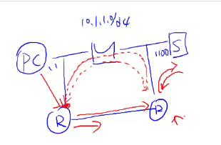

#### 接口TCP/IP

###### 案例：运行FTP的两台主机：应用层和传输层是端到端的协议，网络层使用的是逐跳(hop-by-hop)协议（可以有端到端的方式），链路层是逐媒体的。

- 网络ip提供了不可靠的服务，仅仅尽快地把分组从源节点送到目的节点，不提供可靠性保障；TCP在IP的基础上提供一个可靠的运输层。

- 互联网的目的之一就是在应用程序中隐藏所有物理细节。

  

封装：

以太网帧大小为46-1500个字节

端口号:

- 服务器端口号一般是已知的端口号，例如：ftp 21，telnet 23。
- 客户端端口号为随机的临时端口号，临时端口号分配在1024-5000之间。

##### 链路层：以太网和IEEE 802封装

$$
IP地址为逻辑地址，

MAC地址为硬件地址，

两者配合才能够进行通讯
$$

当数据量比MTU大的时候，会将数据进行分片发送

802.3MAC：MTU = 1492

以太网：MTU = 1500

以太网例：

**环回接口地址**(一般为127开头的任意IP数据，如：127.0.0.1)

环回口地址不经过以太网，直接内部数据传回

##### IP:网际协议

是TCP/IP协议族中最核心的协议，提供不可靠，无连接的数据报传输服务。

所有的TCP，UDP，ICMP，IGMP数据都以IP数据报格式传输

ps:windows下ifconfig和netstat为两个查看ip通讯的指令；linux下为ifconfig

###### IP数据报格式及首部中各字段：

###### IP路由选择

- 实际上大多数主机和一些路由器可以用默认路由来处理任何目的，除非目的在本地局域网上。（动态路由选择在极少情况下能用得到）

- 数据报中目的IP地址始终不发生变化。

- 每个链路层可能具有不同的数据帧首部(MAC地址),而且链路层目的地址(MAC地址)始终指向下一站的链路层地址。以太网（MAC地址一般通过ARP获得）

ps:127.x.x.x为回环地址；-1.x.x.x受限的广播，永远不可能被转发;1.0.0.0以子网为目的的广播

​	DHCP:动态主机配置协议

###### ARP：为IP地址到对应的硬件地址之间提供动态映射（这个过程是自动完成的）。

​		地址解析：为两种地址提供映射：32bit的IP地址和数据链路层使用的地址(MAC地址)。

ps：ARP是基于IP找MAC，RARP是基于MAC找IP，RARP比较少用。

​		arp -a可查看ARP的映射

​		用于以太网的ARP请求或应答分组格式

连接FTP地址，传输数据的流程

1.解析过程

2.请求连接过程

###### Arp代理

外部地址都做了相对应的ip代理处理，所以即使不是直连，也可以收到对应的连接回应

在桥联的基础上添加两个路由器会更快，但是，这样会导致回环通路连接不上。解决办法：1，删除坐左边那个路由器，右边路由器上做手动的arp映射。

ps：arp处理连接请求时是后者优先的

###### 免费arp

自己询问自己自己的IP地址是多少，没有回应就说明没有人使用这个ip，否则就是ip重叠了。

优点：可以比较好的处理地址重叠问题

缺点：arp攻击很简单

###### ICMP：IP层的一个组成部分，传递差错报文以及其他需要注意的信息。

​		ICMP报文通常被IP层或更高层协议（TCP/UDP）使用。

ICMP报文

​		ICMP报文类型由类型字段和代码字段共同决定

​		使用的算法和IP首部校验和算法相同

ICMP差错报文

- 不会导致差错报文的情况
  ICMP差错报文本身不会产生   
  
  目的地址是广播或者多播
  
  作为链路层广播的数据报
  
  不是IP分片的第一片
  
  源地址不是单个主机的数据报。即源地址不能为零地址，环回地址，广播地址或多播地址
- ICMP差错报文结构 
  
  
  
  ​                                                                                                                                                                                                                                                                                                                                                                                                        

###### PING 属于ICMP的一个重要协议，可用于测试另一台主机是否可达

​		可用ping程序确定问题在哪，还能测出到这台主机的往返时间

​		一台主机的可达性可能不只取决于IP层是否可达，还取决于使用何种协议以及端口号。

​		大多数TCP/IP实现都在内核中直接支持ping服务器 

IP记录路由选项（记录的是出接口，最多只能记录9个IP地址）

ping提供-R选项，以提供记录路由的功能，每个处理该IP数据报的路由器都会把他的IP地址放入选项字段中。当数据报到达目的端时，IP地址清单会复制到ICMP回显应答中。同时，数据返回过程经过的路由IP地址也会复制到回显应答中。当ping程序收到回显应答时，会打印出这份IP清单。

IP记录路由选项结构：

###### Traceoute

​		IP路由追踪中，IP记录路由选项只能记录9个路由选项，这在大型网络环境中是远远不够的。在大型网络环境中追踪路由是要使用Traceoute技术实现。

​		Traceoute用的是UDP的包。

​		Traceoute程序使用ICMP报文和IP首部中的TTL字段。TTL字段是由发送端初始设置的一个8bit字段。ping过程中，发送ICMP回显应答时经常把TTL设为最大值255。

> PS
>
> 当路由器收到的IP数据报中TTL字段是0或1时，路由器不转发该数据报。反而会丢弃该数据，并给信号源发一份“超时”信息。
>
> Traceoute的UDP端口号为30000+，当到达目的端口时会返回端口不可达信息，如果传输过程出问题就好返回传输超时信息。

IP源站选路选项（source routing）：由发送者指定路由。

- 严格的源站选路：发送端指明了一个数据报所必须采用的确切路由，即每一跳都是直连。如果一个路由器发现源路由所指定的下一个路由器不在直接连接的网络上就会返回“源站路由失败”的ICMP差错报文。

- 宽松的源站选路:发送端指明了一个数据报经过的IP地址清单，同时数据报在清单上指明了任意两个地址直接可以通过的其他路由器。

- 源站路由选项的格式跟IP记录路由选项结构基本一致，对于源站路由IP地址清单必须在发送IP数据报前填充

  

###### IP源站选路过程：

> PS
>
> 源站路由可以使路由跳过防火墙，直接链接下一站。
>
> 禁用源站路由：no ip source-route
>
> 安全问题比较多

###### IP选路

UDP

广播与多播

DNS

TFTP

应用层协议：FTP，Telnet，HTTP，SMYP/POP3，SSL，SNMP，SIP

